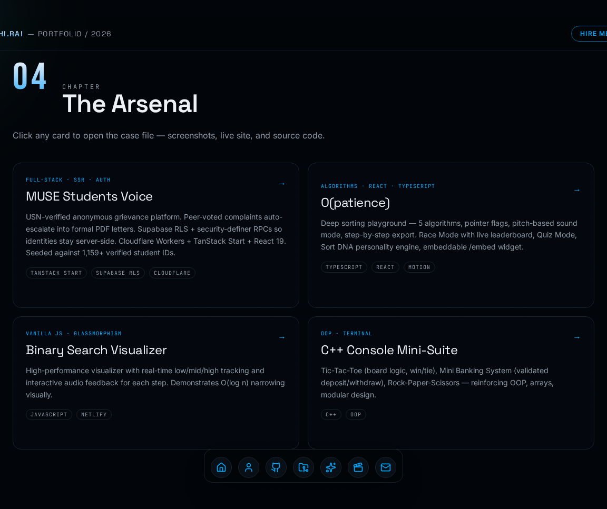
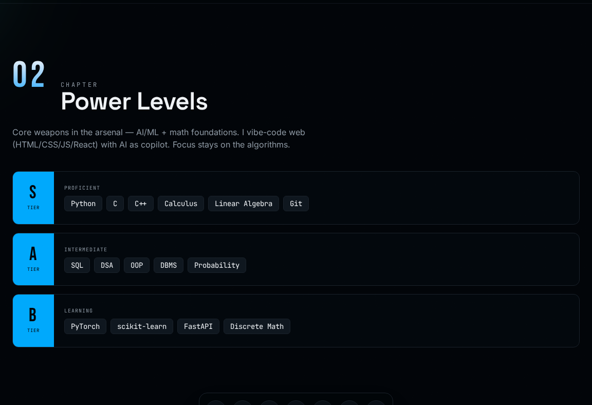
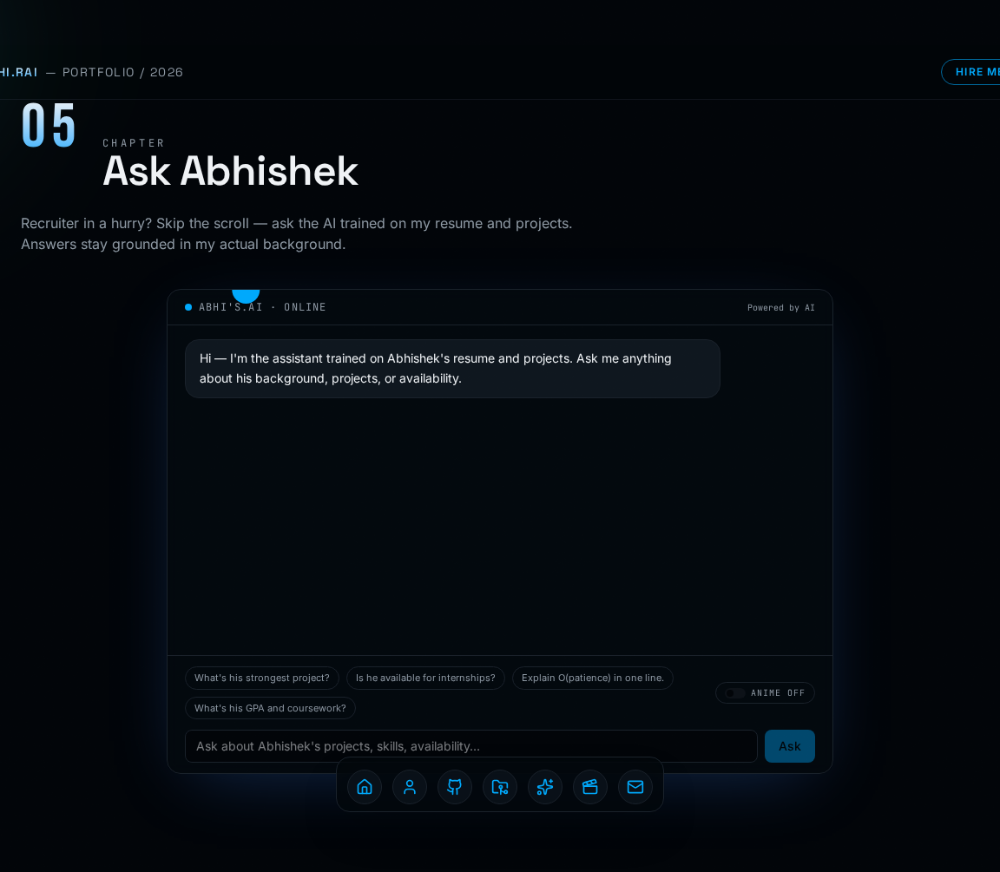
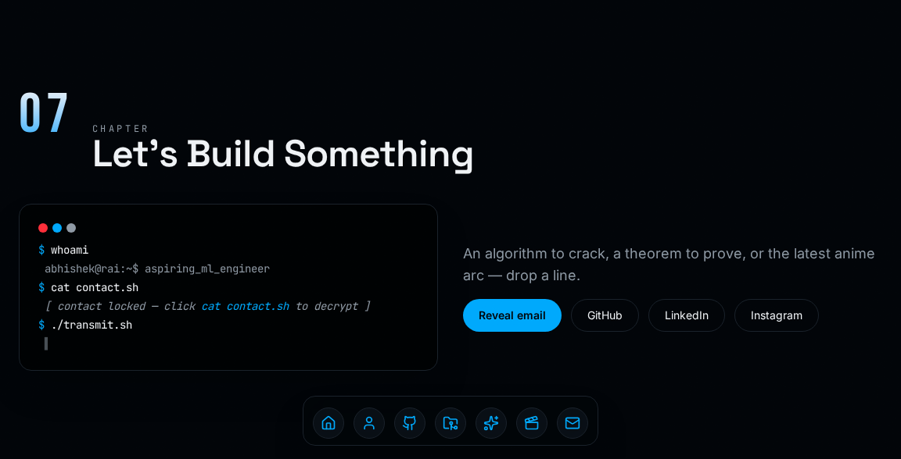

# Abhishek Rai A — Portfolio

A scroll-driven, 3D-accented personal portfolio for **Abhishek Rai A** (B.E. in AI & ML, University of Mysore). Built as a single narrative page with chapter-based sections, live GitHub activity, an interactive "Ask Abhishek" AI assistant, and real project case studies.

**Live:** https://portfolio-abhirai2006.lovable.app


---

## Highlights

- **Cinematic hero scene** — React Three Fiber torus-knot with a mouse-reactive particle field, cursor glow, and a spotlight-mask portrait reveal.
- **Chapter-based storytelling** — Origin, Power Levels, Live Code, Arsenal, Ask Abhishek, Anime Shelf, Contact.
- **Live GitHub activity** — real repos, language breakdown, and a daily contribution heatmap pulled from the GitHub REST API (10-minute server cache).
- **Interactive project gallery** — modal case studies with image carousels, terminal previews for console apps, magnetic "Open" cursor, MagicCard spotlight hover, and direct links to live sites.
- **Ask Abhishek** — a streaming AI assistant (SSE, token-by-token) grounded in a resume + lifestyle context dump, with an optional Anime Mode easter egg (Gen Z tone, references drawn only from the shelf on the site).
- **The Reel** — an opt-in anime section with real hover-preview video clips and a shared-element morph into a full-screen stage.
- **Light / dark theme** — toggle in the top nav with a horizontal wipe transition (View Transitions API).
- **Motion system** — Dock navigation, magnetic buttons, odometer counters, infinite slider, border trails, word-by-word headline reveals, and an animated film-grain overlay.
- **Direct hiring path** — "Hire me" opens a pre-filled email (subject + body) instead of dumping the visitor at a form.
- **Privacy-aware contact block** — email and phone are obfuscated in source and revealed on demand.
- **Accessible + responsive** — ARIA labels throughout, reduced-motion support, and mobile / tablet / desktop layouts plus a PWA manifest and custom favicon.

## Screens

**Chapter 03 — Live Code Activity** (live GitHub repos, language mix, contribution heatmap)


**Chapter 04 — The Arsenal** (project case-study cards, each opens a modal)



| Chapter 02 — Power Levels | Chapter 05 — Ask Abhishek |
| --- | --- |
|  |  |

| Chapter 06 — Anime Shelf | Chapter 07 — Contact terminal |
| --- | --- |
|  |  |

**Responsive** — the same page on a 390px viewport:


## Tech stack

| Layer            | Choice                                                        |
| ---------------- | ------------------------------------------------------------- |
| Framework        | TanStack Start (React 19, SSR on Cloudflare Workers)          |
| Build            | Vite 8                                                        |
| Styling          | Tailwind CSS v4 (OKLCH design tokens, `@tailwindcss/vite`)    |
| 3D               | three.js via `@react-three/fiber` + `@react-three/drei`       |
| Motion           | GSAP, Framer Motion, Lenis smooth scroll                      |
| AI               | Lovable AI Gateway (`google/gemini-3.6-flash`)                |
| Backend          | Lovable Cloud (Supabase) — auth-attacher middleware, RLS-ready |
| Language         | TypeScript (strict)                                           |

## Project structure

```text
src/
  routes/
    __root.tsx              Root layout, fonts, favicon, manifest, SEO
    index.tsx               Full single-page portfolio (chapters 01–07)
    api/
      chat.ts               Ask Abhishek — POST endpoint, SSE streaming via Lovable AI Gateway
  components/portfolio/
    Nav.tsx                 Sticky navigation with theme toggle + Hire Me CTA
    HeroScene.tsx           R3F torus-knot + particle field
    SpotlightPortrait.tsx   Cursor-following mask reveal on the portrait
    CursorGlow.tsx          Mouse-reactive radial glow (desktop only)
    GithubLive.tsx          Live repos + language stats
    ContributionHeatmap.tsx GitHub-style daily commit grid
    MagicCard.tsx           Spotlight-on-hover card wrapper
    ProjectModal.tsx        Case-study modal with carousel + terminal snippets
    AskAbhishek.tsx         Streaming chat UI with Anime Mode toggle
    TechniqueVault.tsx      "The Reel" — anime video clips + shared-element stage
    ThemeToggle.tsx         Light/dark switch with wipe transition
  components/motion/        Reusable primitives: dock, magnetic, animated-number,
                            border-trail, infinite-slider, text effects, word-reveal
  lib/
    github.functions.ts     TanStack server functions for GitHub data
  integrations/supabase/    Auto-generated Lovable Cloud client + middleware
  styles.css                Tailwind v4 theme (Navy / White / Emerald / Red), light + dark
```

## Local development

**Prerequisites:** [Bun](https://bun.sh) (recommended) or Node 20+.

```bash
bun install
bun run dev          # http://localhost:8080
bun run build        # production build
bun run lint         # ESLint
bun run format       # Prettier
```

### Environment variables

Lovable auto-provisions the following. Only set them manually if running outside Lovable:

| Variable                         | Purpose                                          | Scope   |
| -------------------------------- | ------------------------------------------------ | ------- |
| `LOVABLE_API_KEY`                | Lovable AI Gateway (Ask Abhishek endpoint)       | Server  |
| `VITE_SUPABASE_URL`              | Lovable Cloud project URL                        | Client  |
| `VITE_SUPABASE_PUBLISHABLE_KEY`  | Lovable Cloud publishable key                    | Client  |
| `VITE_SUPABASE_PROJECT_ID`       | Lovable Cloud project id                         | Client  |

Never expose `LOVABLE_API_KEY` to the client — it is only read inside server route handlers.

## Ask Abhishek — how it works

`src/routes/api/chat.ts` exposes a `POST /api/chat` handler that:

1. Accepts `{ messages, animeMode }` from the client.
2. Trims history to the last 12 turns and validates roles/lengths.
3. Injects a resume- and lifestyle-grounded system prompt (plus an Anime Mode addon when enabled).
4. Calls `https://ai.gateway.lovable.dev/v1/chat/completions` with `google/gemini-3.6-flash` and `stream: true`.
5. Pipes the upstream SSE stream straight to the browser, so answers type out token by token.
6. Surfaces rate limits (429) and credit exhaustion (402) as friendly errors.

Anime Mode is off by default. It is a subtle personality layer — factual answers stay intact; a single `// side note` line adds a paraphrased anime reference drawn only from the shelf shown on the site.

## Deployment

Deployed on Cloudflare Workers via Lovable. Push to `main` and Lovable rebuilds automatically. Stable URLs:

- Production: `https://portfolio-abhirai2006.lovable.app`
- Preview: `https://project--<id>-dev.lovable.app`

## Credits

Design, code, and content: **Abhishek Rai A** — [GitHub](https://github.com/Abhirai2006) · [LinkedIn](https://www.linkedin.com/in/abhishek-rai-a-00067238b)

## License

Source code released under the MIT License. Personal content (résumé text, portrait, project screenshots) is © Abhishek Rai A and not licensed for reuse.
