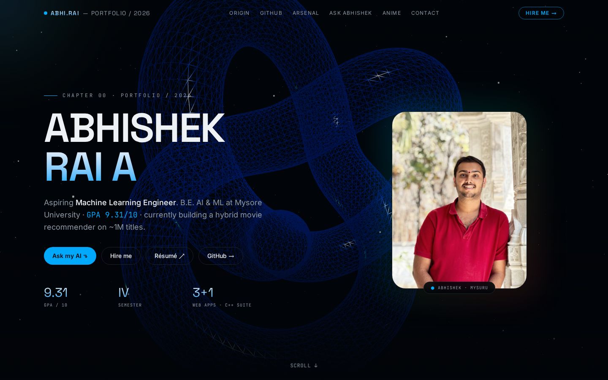
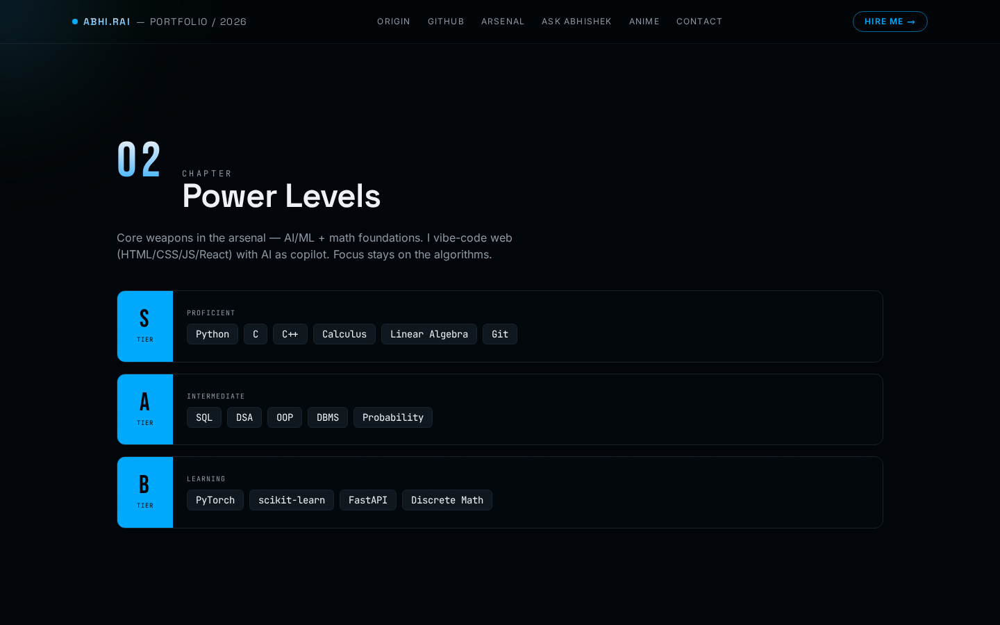
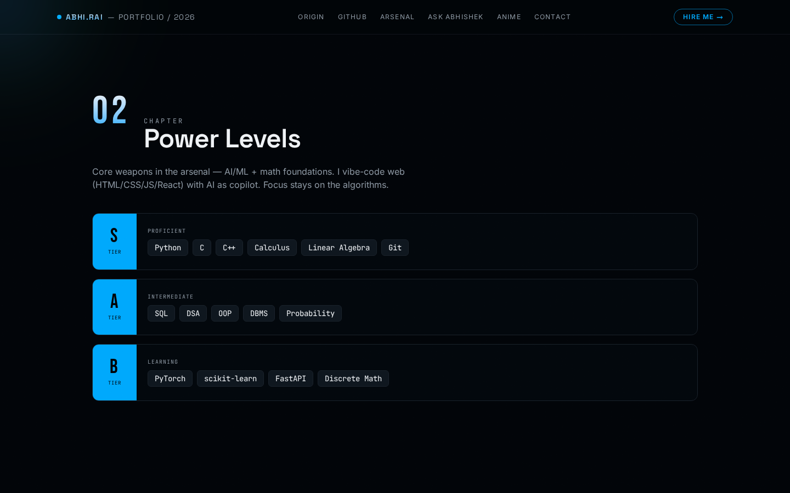
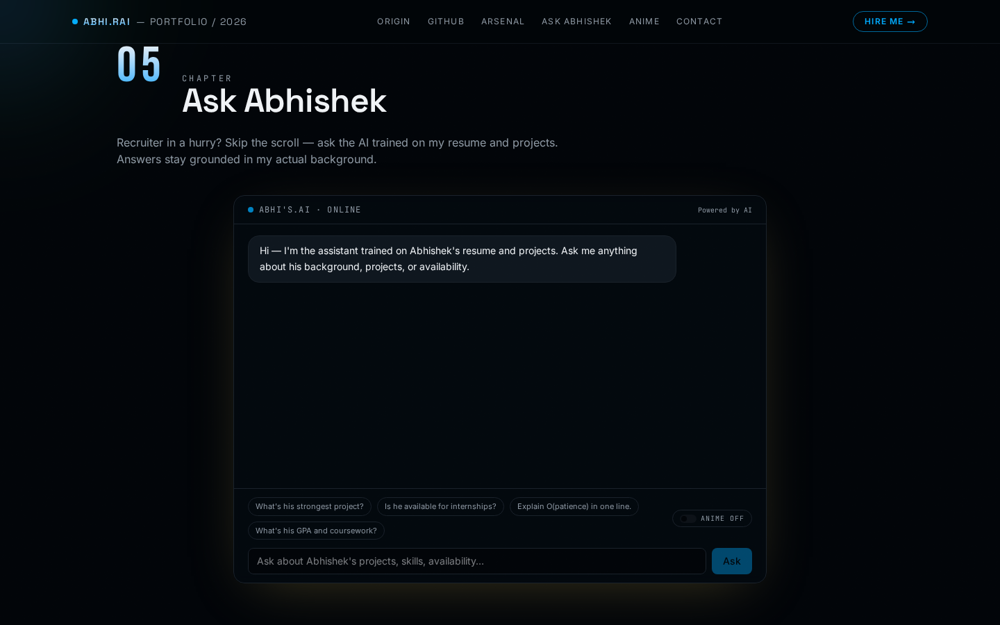
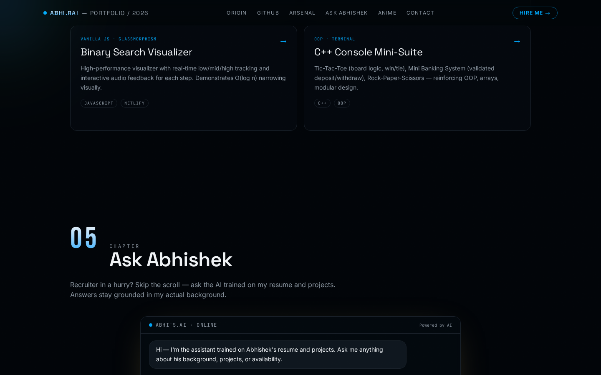
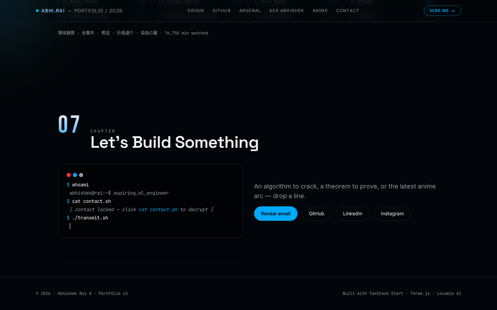
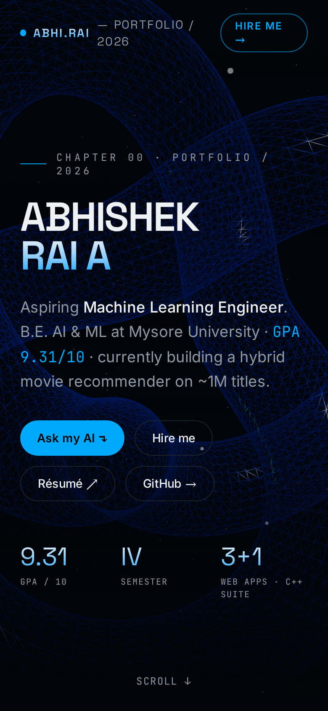

# Abhishek Rai A — Portfolio

A scroll-driven, 3D-accented personal portfolio for **Abhishek Rai A** (B.E. in AI & ML, University of Mysore). Built as a single narrative page with chapter-based sections, live GitHub activity, an interactive "Ask Abhishek" AI assistant, and real project case studies.

**Live:** https://portfolio-abhirai2006.lovable.app



---

## Highlights

- **Cinematic hero scene** — React Three Fiber torus-knot with a mouse-reactive particle field and animated cursor glow.
- **Chapter-based storytelling** — Origin, Arsenal, Live Code, Projects, Anime Shelf, Contact.
- **Live GitHub activity** — real repos, language breakdown, and a daily contribution heatmap pulled from the GitHub REST API.
- **Interactive project gallery** — modal case studies with image carousels, terminal previews for console apps, and direct links to live sites.
- **Ask Abhishek** — an AI assistant grounded in resume context, with an optional Anime Mode easter egg (Gen Z tone, references from the actual anime shelf).
- **Privacy-aware contact block** — email and phone are obfuscated in source and revealed on demand.
- **Fully responsive** — mobile, tablet, and desktop layouts, plus a PWA manifest and custom favicon.

## Screens

| Live GitHub activity | Arsenal (projects) |
| --- | --- |
|  |  |

| Ask Abhishek | Anime Shelf |
| --- | --- |
|  |  |

| Contact terminal | Mobile |
| --- | --- |
|  |  |

## Tech stack

| Layer            | Choice                                                        |
| ---------------- | ------------------------------------------------------------- |
| Framework        | TanStack Start (React 19, SSR on Cloudflare Workers)          |
| Build            | Vite 8                                                        |
| Styling          | Tailwind CSS v4 (OKLCH design tokens, `@tailwindcss/vite`)    |
| 3D               | three.js via `@react-three/fiber` + `@react-three/drei`       |
| Motion           | GSAP, Framer Motion, Lenis smooth scroll                      |
| AI               | Lovable AI Gateway (`google/gemini-3.6-flash`)                |
| Backend          | Lovable Cloud (Supabase) — auth-attacher middleware, RLS-ready |
| Language         | TypeScript (strict)                                           |

## Project structure

```text
src/
  routes/
    __root.tsx              Root layout, fonts, favicon, manifest, SEO
    index.tsx               Full single-page portfolio (chapters 01–07)
    api/
      chat.ts               Ask Abhishek — POST endpoint, Lovable AI Gateway
  components/portfolio/
    Nav.tsx                 Sticky navigation with Hire Me CTA
    HeroScene.tsx           R3F torus-knot + particle field
    CursorGlow.tsx          Mouse-reactive radial glow (desktop only)
    GithubLive.tsx          Live repos + language stats
    ContributionHeatmap.tsx GitHub-style daily commit grid
    ProjectModal.tsx        Case-study modal with carousel + terminal snippets
    AskAbhishek.tsx         Chat UI with Anime Mode toggle
  lib/
    github.functions.ts     TanStack server functions for GitHub data
  integrations/supabase/    Auto-generated Lovable Cloud client + middleware
  styles.css                Tailwind v4 theme (Navy / White / Emerald / Red)
```

## Local development

**Prerequisites:** [Bun](https://bun.sh) (recommended) or Node 20+.

```bash
bun install
bun run dev          # http://localhost:8080
bun run build        # production build
bun run lint         # ESLint
bun run format       # Prettier
```

### Environment variables

Lovable auto-provisions the following. Only set them manually if running outside Lovable:

| Variable                         | Purpose                                          | Scope   |
| -------------------------------- | ------------------------------------------------ | ------- |
| `LOVABLE_API_KEY`                | Lovable AI Gateway (Ask Abhishek endpoint)       | Server  |
| `VITE_SUPABASE_URL`              | Lovable Cloud project URL                        | Client  |
| `VITE_SUPABASE_PUBLISHABLE_KEY`  | Lovable Cloud publishable key                    | Client  |
| `VITE_SUPABASE_PROJECT_ID`       | Lovable Cloud project id                         | Client  |

Never expose `LOVABLE_API_KEY` to the client — it is only read inside server route handlers.

## Ask Abhishek — how it works

`src/routes/api/chat.ts` exposes a `POST /api/chat` handler that:

1. Accepts `{ messages, animeMode }` from the client.
2. Trims history to the last 12 turns and validates roles/lengths.
3. Injects a resume-grounded system prompt (plus an Anime Mode addon when enabled).
4. Calls `https://ai.gateway.lovable.dev/v1/chat/completions` with `google/gemini-3.6-flash`.
5. Surfaces rate limits (429) and credit exhaustion (402) as friendly errors.

Anime Mode is off by default. It is a subtle personality layer — factual answers stay intact; a single `// side note` line adds a paraphrased anime reference drawn only from the shelf shown on the site.

## Deployment

Deployed on Cloudflare Workers via Lovable. Push to `main` and Lovable rebuilds automatically. Stable URLs:

- Production: `https://portfolio-abhirai2006.lovable.app`
- Preview: `https://project--<id>-dev.lovable.app`

## Credits

Design, code, and content: **Abhishek Rai A** — [GitHub](https://github.com/Abhirai2006) · [LinkedIn](https://www.linkedin.com/in/abhishek-rai-a-00067238b)

## License

Source code released under the MIT License. Personal content (résumé text, portrait, project screenshots) is © Abhishek Rai A and not licensed for reuse.
